# trade-system-0 MVP Architecture

本仓库设计时参考了 trend-trader 的实现文档（见 `docs/reference/trend-trader/`）。实现保留文档中的模块边界：

- `src/`：React + TypeScript + Vite 前端。
  - `pages/MyWatchlistPage.tsx` — 首页"我的自选"，三栏布局（自选列表 | K线图表 | 股票详情）。
  - `components/chart/` — K线图表、工具栏、设置面板、悬浮详情。
  - `components/watchlist/` — 自选侧栏（分组/排序/右键菜单）、股票信息面板。
- `src-tauri/src/commands/`：Tauri command IPC 层（含 `stock_meta`、`watchlist_ops` 等命令）。
- `src-tauri/src/services/`：业务编排层（含 `market_sync_service` 负责从 market-sync DuckDB ATTACH + 物化）。
- `src-tauri/src/db/`：SQLite、DuckDB 连接与迁移。
- `src-tauri/src/llm/`：OpenAI-compatible 客户端、Prompt、JSON guard。

K 线数据由独立项目 **market-sync**（`~/data/market-sync/`）维护，每日 18:00 cron 自动从 TickFlow 拉取全市场日 K，存储到 `~/.data/duckdb/market/market.duckdb`。trade-system-0 不直接访问 TickFlow，只通过 `refresh_from_market` 命令从该 DuckDB 读取。

评分与图表读取链路：

```text
market-sync (cron) -> TickFlow API -> ~/.data/duckdb/market/market.duckdb (fact_kline)
refresh_from_market (Rust) -> ATTACH market.duckdb -> symbol映射 + 衍生字段计算 -> kline_bars (trade-system-0 DuckDB)
get_bars      -> DuckDB only（含复权参数 adj: pre|none）
get_stock_meta -> securities + kline_bars -> 最新价/涨跌/陈旧检测
score_stock   -> coverage -> get_bars summaries (1d/1w/1M/1Q/1Y) -> LLM -> stock_reviews
```

DuckDB 核心表：

| 表 | 说明 |
|------|------|
| `securities` | 标的元数据（含 latest_price/change_pct/latest_date 缓存、market_symbol） |
| `kline_bars` | 统一 K 线表（symbol/period/adj_mode/trade_date 复合主键） |
| `kline_mapping` | market-sync 映射表（trade_symbol ↔ app_symbol，同步水位） |
| `trade_calendar` | 交易日历 |
| `kline_sync_runs` | 同步审计日志 |

支持的 K 线周期：`1d`、`1w`、`1M`、`1Q`、`1Y`。

## 系统模块架构

```mermaid
graph TB
    subgraph Frontend["Frontend — React + TypeScript + Vite"]
        direction TB
        subgraph Pages["Pages"]
            WL[MyWatchlistPage<br/>三栏布局首页]
            KD[KlineDataPage<br/>数据集市管理]
            SR[StockReviewPage<br/>个股评分]
            DR[DailyReviewPage<br/>每日复盘]
            AP[AgentPage<br/>AI Agent 对话]
            TS[TradeSystemPage<br/>交易系统编辑器]
            SP[SettingsPage<br/>模型/供应商配置]
        end
        subgraph Components["Components"]
            direction LR
            CH[chart/<br/>KLineChart 工具栏 设置面板]
            CW[watchlist/<br/>侧栏 分组排序 右键菜单]
            CL[layout/<br/>窗口标题栏]
            CS[shared/<br/>Badge Button Input Panel DataTable]
        end
    end

    subgraph IPC["Tauri IPC Bridge"]
        INVOKE[@tauri-apps/api invoke]
    end

    subgraph Commands["Commands Layer — src-tauri/src/commands/"]
        direction TB
        CMD_KLINE[kline.rs<br/>sync_kline get_bars<br/>get_data_coverage list_securities]
        CMD_DATA[data_ops.rs<br/>search_securities get_data_health<br/>sync_securities_metadata]
        CMD_META[stock_meta.rs<br/>get_stock_meta]
        CMD_WL[watchlist.rs + watchlist_ops.rs<br/>CRUD 分组 排序 拖拽]
        CMD_REVIEW[review.rs<br/>score_stock get_stock_reviews<br/>run_daily_review]
        CMD_AGENT[agent.rs<br/>create_agent run_agent_chat]
        CMD_PROV[provider.rs<br/>CRUD 模型供应商 测试连接]
        CMD_TSYS[trade_system.rs<br/>导入素材 生成草稿 版本管理]
        CMD_ANNO[annotation.rs<br/>图表标注 CRUD]
    end

    subgraph Services["Services Layer — src-tauri/src/services/"]
        direction TB
        SVC_MARKET[market_sync_service<br/>ATTACH market-sync DuckDB<br/>映射 物化 衍生字段计算]
        SVC_QUERY[kline_query_service<br/>K线只读查询<br/>覆盖率 标的列表]
        SVC_WL[watchlist_service<br/>自选分组 CRUD<br/>排序 拖拽]
        SVC_REVIEW[review_service<br/>评分 LLM 调用<br/>每日复盘]
        SVC_AGENT[agent_service<br/>Agent 对话编排]
        SVC_TSYS[trade_system_service<br/>Markdown SSOT 管理<br/>素材导入 缺口检测]
        SVC_PROV[model_provider_service<br/>供应商配置 加解密]
        SVC_ANNO[annotation_service<br/>图表标注存储]
        SVC_COMMON[common<br/>ID 生成]
    end

    subgraph LLM["LLM Layer — src-tauri/src/llm/"]
        direction LR
        LLM_CLIENT[client.rs<br/>OpenAI-compatible HTTP]
        LLM_PROMPT[prompts.rs<br/>Prompt 模板]
        LLM_GUARD[json_guard.rs<br/>JSON 解析/修复]
    end

    subgraph DB["Database Layer — src-tauri/src/db/"]
        direction LR
        DUCK[duckdb.rs<br/>DuckDB 连接池<br/>kline_bars securities<br/>trade_calendar kline_sync_runs]
        SQL[sqlite.rs<br/>SQLite 连接<br/>应用状态/配置]
        MIG[migrations.rs<br/>DuckDB DDL 迁移]
    end

    subgraph MarketSync["market-sync — ~/data/market-sync/"]
        direction TB
        MS_CRON[cron 18:00<br/>每日自动调度]
        MS_SYNC[sync_daily.py<br/>增量+轮转全量同步]
        MS_DB[market.duckdb<br/>fact_kline dim_instrument<br/>v_kline_weekly/monthly/yearly]
    end

    subgraph External["External APIs"]
        TF[TickFlow API<br/>api.tickflow.com]
        LLM_EXT[LLM Providers<br/>OpenAI / 兼容接口]
    end

    %% Frontend → IPC
    Pages --> INVOKE
    Components --> Pages

    %% IPC → Commands
    INVOKE --> CMD_KLINE
    INVOKE --> CMD_DATA
    INVOKE --> CMD_META
    INVOKE --> CMD_WL
    INVOKE --> CMD_REVIEW
    INVOKE --> CMD_AGENT
    INVOKE --> CMD_PROV
    INVOKE --> CMD_TSYS
    INVOKE --> CMD_ANNO

    %% Commands → Services
    CMD_KLINE --> SVC_MARKET
    CMD_KLINE --> SVC_QUERY
    CMD_DATA --> SVC_MARKET
    CMD_DATA --> SVC_QUERY
    CMD_META --> SVC_QUERY
    CMD_WL --> SVC_WL
    CMD_REVIEW --> SVC_REVIEW
    CMD_AGENT --> SVC_AGENT
    CMD_TSYS --> SVC_TSYS
    CMD_PROV --> SVC_PROV
    CMD_ANNO --> SVC_ANNO

    %% Services → LLM
    SVC_REVIEW --> LLM_CLIENT
    SVC_AGENT --> LLM_CLIENT
    SVC_TSYS --> LLM_CLIENT
    LLM_CLIENT --> LLM_PROMPT
    LLM_CLIENT --> LLM_GUARD

    %% Services → DB
    SVC_MARKET --> DUCK
    SVC_QUERY --> DUCK
    SVC_WL --> SQL
    SVC_WL --> DUCK
    SVC_REVIEW --> SQL
    SVC_REVIEW --> DUCK
    SVC_AGENT --> SQL
    SVC_TSYS --> SQL
    SVC_PROV --> SQL
    SVC_ANNO --> SQL
    MIG --> DUCK

    %% MarketSync → External
    MS_SYNC --> TF
    SVC_MARKET -- ATTACH READ_ONLY --> MS_DB

    %% LLM → External
    LLM_CLIENT --> LLM_EXT

    %% Styles
    style Frontend fill:#121212,stroke:#4d90fe,color:#e0e0e0
    style IPC fill:#1a1a1a,stroke:#f0b93b,color:#e0e0e0
    style Commands fill:#121212,stroke:#4d90fe,color:#e0e0e0
    style Services fill:#121212,stroke:#ff6b35,color:#e0e0e0
    style LLM fill:#121212,stroke:#f0b93b,color:#e0e0e0
    style DB fill:#121212,stroke:#4d90fe,color:#e0e0e0
    style MarketSync fill:#121212,stroke:#ff6b35,color:#e0e0e0
    style External fill:#1a1a1a,stroke:#2a2a2a,color:#888888
```

## 数据流

```mermaid
sequenceDiagram
    participant U as 用户
    participant FE as React 前端
    participant CMD as Tauri Command
    participant SVC as Service
    participant DUCK as DuckDB
    participant LLM as LLM Provider

    rect rgb(18, 18, 18)
        Note over U,DUCK: K线同步链路（market-sync）
        U->>FE: 点击"一键补齐"
        FE->>CMD: invoke refresh_from_market
        CMD->>SVC: refresh_from_market()
        SVC->>SVC: ATTACH ~/.data/duckdb/market/market.duckdb (READ_ONLY)
        SVC->>DUCK: 更新 kline_mapping（symbol映射+水位）
        SVC->>DUCK: INSERT kline_bars（窗口函数计算衍生字段）
        SVC->>DUCK: 聚合 1w/1M/1Q/1Y
        SVC->>DUCK: DETACH
        SVC-->>CMD: KlineSyncResult
        CMD-->>FE: invalidate queries
    end

    rect rgb(18, 18, 18)
        Note over U,LLM: 评分链路
        U->>FE: 点击"评分"
        FE->>CMD: invoke score_stock(symbol)
        CMD->>SVC: score_stock()
        SVC->>DUCK: get_bars (coverage check)
        SVC->>DUCK: get_bars summaries (1d/1w/1M/1Q/1Y)
        SVC->>LLM: Chat Completions (scoring prompt)
        LLM-->>SVC: 评分 JSON
        SVC->>SQL: INSERT stock_reviews
        SVC-->>CMD: StockReview
        CMD-->>FE: 评分结果
    end
```


